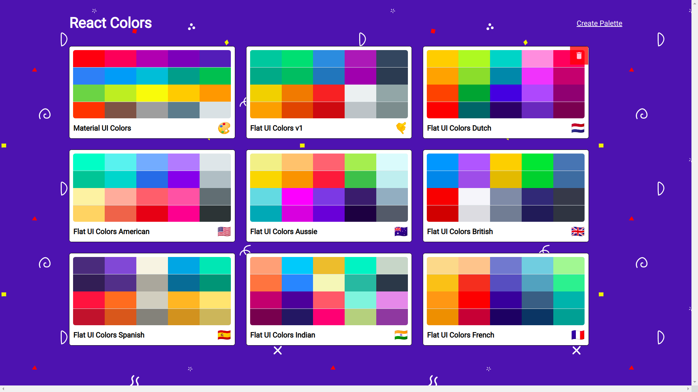
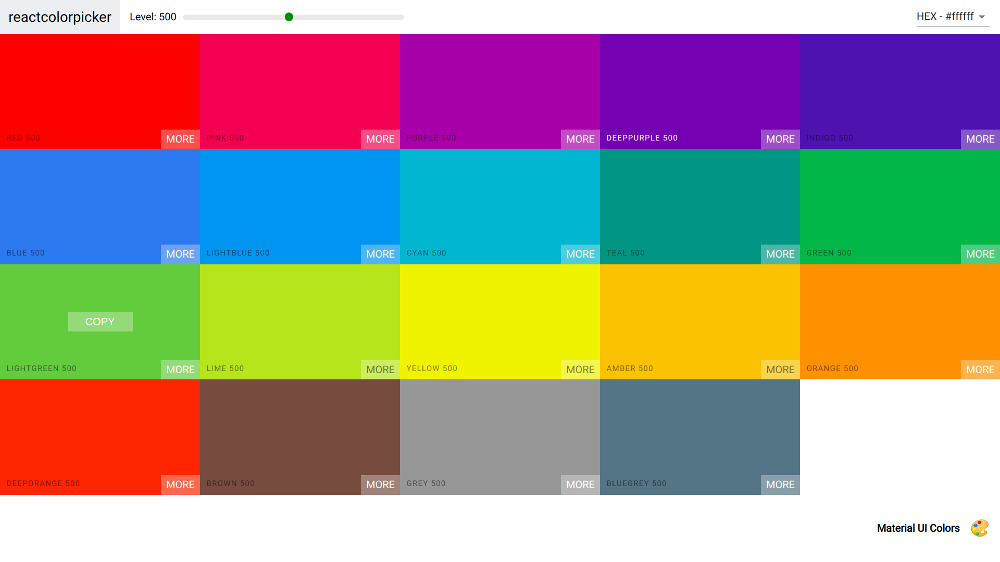
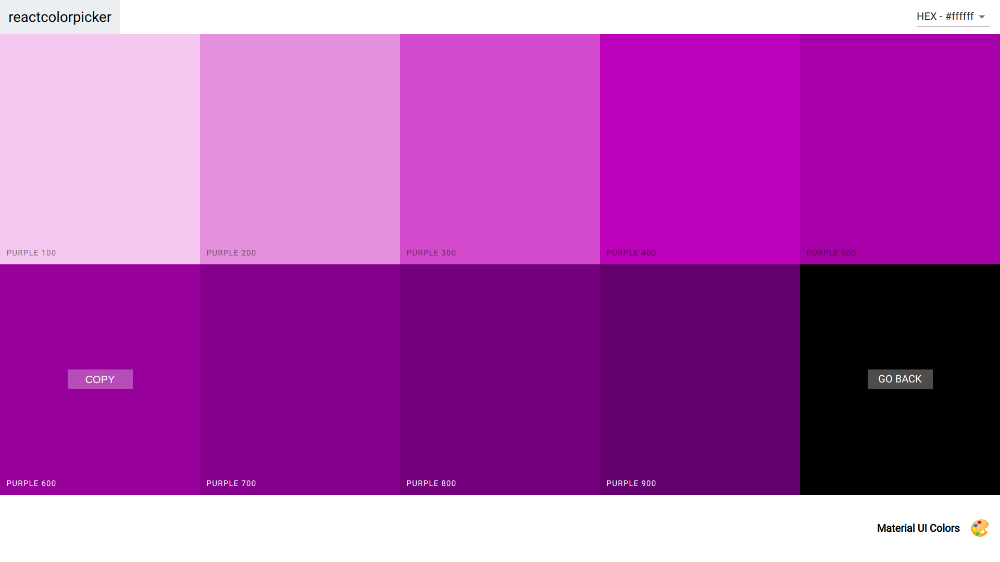
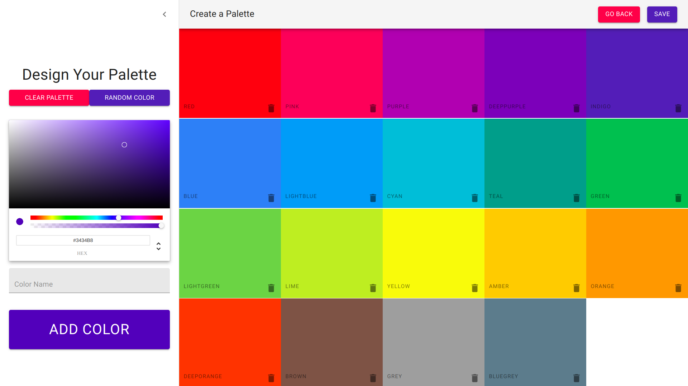
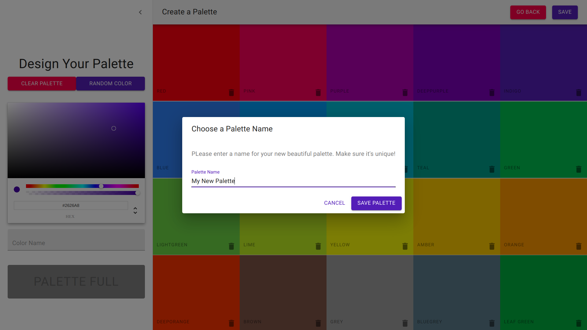

# React Color App

- A web application that allows users to create, design and save color palettes built in react.
- It is a clone of [FlatUIColors](https://flatuicolors.com/) site.

### Home Screen

### View Indiviudal Palette

### View the different variants of individual color

We can copy the color codes in hex, rgba and rgb formats onto our clipboard.

### Create our own palette

## Usage

1.  Run

- `git clone https://github.com/pratham022/Color-App.git`
- `cd Color-App`
- `npm install`

2.  Run `npm start`
